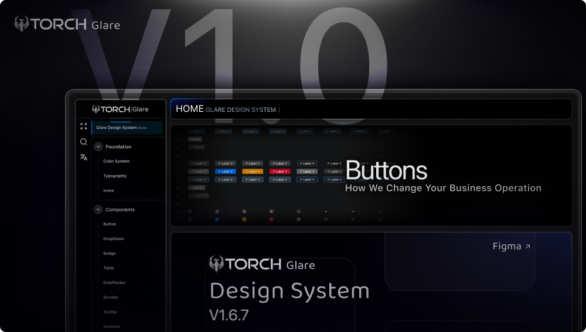

# TORCH Glare Components Library

Welcome to the **TORCH Glare Components Library**! This library offers a comprehensive set of reusable React components designed to help you build modern, efficient user interfaces. It also includes a powerful CLI tool (**torch-glare CLI**) to simplify component management and integration.

## Documentation
You can find the complete documentation at: [https://glare.torchcorp.com](https://glare.torchcorp.com)

## Contributing
We’re excited to welcome contributors! To get started:

1. Fork the repository.
2. Create a new branch.
3. Implement your changes.
4. Commit with a descriptive message.
5. Push your branch and open a pull request.

### Contribution Guidelines
- Adhere to the existing code style.
- Update or add documentation where applicable.

## License
This project is licensed under the **MIT License**.

